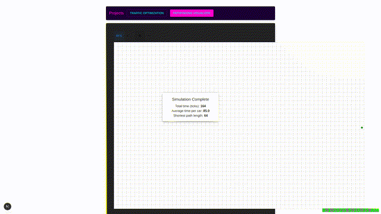

# Status

Using my [Puppeteer GitHub Action](https://github.com/ashfordhill/puppeteer-action).

Experimenting with Zencoder.

### Latest View


### History



### Installation

Use pnpm locally to cache `node_modules` for cache'd node package installs:

``` sh
npm i -g pnpm
cd ash-portfolio
pnpm i
npm run dev
```
