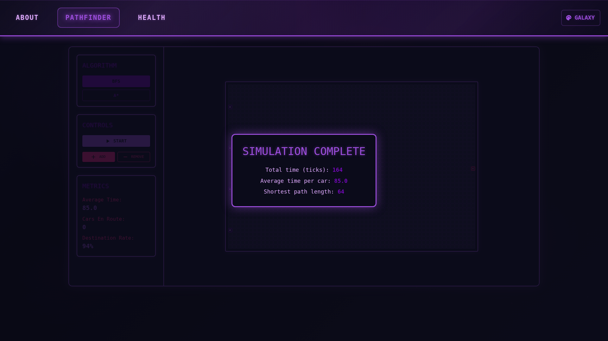

# Status

Using my [Puppeteer GitHub Action](https://github.com/ashfordhill/puppeteer-action)

Timelapse of Main:


Latest Screenshot (branch-specific)


# Showcase

## Pathfinder

### Installation

1. Clone the repository:
   ```bash
   git clone https://github.com/yourusername/pathfinding-visualizer.git
   cd pathfinding-visualizer
   ```

2. Install dependencies:
   ```bash
   cd ash-portfolio
   npm install
   ```

3. Start the development server:
   ```bash
   npm run dev
   ```

4. Open browser and navigate to `http://localhost:3000`